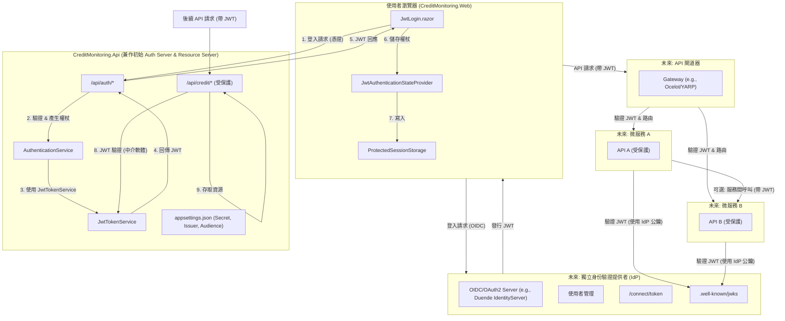

# JWT 身份驗證設計文件 (微服務架構考量)

## 1. 緒論

### 1.1. 目的

本文件旨在詳細說明在 `CreditMonitoring` 系統中實施基於 JSON Web Token (JWT) 的身份驗證機制。此設計不僅涵蓋當前應用程式 (API 和 Web) 的整合，也為未來擴展至包含多個 API 和 Web 應用程式的微服務架構奠定基礎。

### 1.2. 背景

目前系統包含 `CreditMonitoring.Api` 和 `CreditMonitoring.Web`。隨著系統功能的擴展和潛在的微服務化，需要一個安全、可擴展且標準化的身份驗證方案。JWT 因其無狀態、易於跨服務傳遞和驗證的特性，成為此架構的理想選擇。

### 1.3. 範圍

* JWT 的產生、驗證和管理。
* `CreditMonitoring.Api` 作為初始的身份驗證服務和資源伺服器。
* `CreditMonitoring.Web` 作為 JWT 的用戶端。
* 在 IIS 上部署的考量。
* 未來擴展至完整微服務架構的指導方針。

## 2. 核心 JWT 組件與流程

### 2.1. 組件

* **`CreditMonitoring.Common.Services.JwtTokenService`**:
  * 負責 JWT 的產生 (signing)、驗證 (validation) 和解析 (parsing)。
  * 使用對稱或非對稱金鑰進行簽章。
* **`CreditMonitoring.Common.Services.AuthenticationService`**:
  * 實現 `IAuthenticationService` 介面。
  * 處理使用者登入邏輯，驗證使用者憑證。
  * 成功驗證後，調用 `JwtTokenService` 產生 JWT。
* **`CreditMonitoring.Api.Controllers.AuthController`**:
  * 提供 HTTP 端點供用戶端進行身份驗證操作：
    * `POST /api/auth/login`: 使用者登入，成功後回傳 JWT。
    * `POST /api/auth/refresh`: (可選) 使用更新權杖 (refresh token) 獲取新的 JWT。
    * `GET /api/auth/userinfo`: (可選) 獲取已驗證使用者的資訊。
    * `POST /api/auth/validate`: (可選) 驗證權杖的有效性。
* **`CreditMonitoring.Web.Services.JwtAuthenticationStateProvider`**:
  * 在 Blazor Web 應用程式中管理 JWT 和身份驗證狀態。
  * 從安全儲存 (如 `ProtectedSessionStorage`) 讀取和寫入 JWT。
  * 解析 JWT 中的宣告 (claims) 以確定使用者身份和角色。
* **JWT 設定 (`CreditMonitoring.Api/appsettings.json`)**:
  * `SecretKey`: 用於簽署 JWT 的密鑰 (對於對稱加密)。
  * `Issuer`: JWT 的發行者。
  * `Audience`: JWT 的預期接收者 (通常是 API 本身或相關服務)。
  * `ExpirationMinutes`: JWT 的有效期限。

### 2.2. 基本認證流程

1. **使用者登入**:
    * 使用者在 `CreditMonitoring.Web` (例如 `JwtLogin.razor` 頁面) 輸入憑證。
    * Web 應用程式將憑證傳送至 `CreditMonitoring.Api` 的 `/api/auth/login` 端點。
2. **權杖產生**:
    * `AuthController` 調用 `AuthenticationService` 驗證憑證。
    * 若驗證成功，`AuthenticationService` 調用 `JwtTokenService` 產生 JWT。
    * API 將 JWT 回傳給 Web 應用程式。
3. **權杖儲存**:
    * `CreditMonitoring.Web` 收到 JWT 後，`JwtAuthenticationStateProvider` 將其安全地儲存在瀏覽器中 (例如，使用 `ProtectedSessionStorage`)。
4. **API 請求授權**:
    * 當 Web 應用程式需要存取受保護的 API 資源時，它會在 HTTP 請求的 `Authorization` 標頭中附加 JWT (通常使用 `Bearer` 機制)。
    * 例如: `Authorization: Bearer <your_jwt_token>`
5. **API 權杖驗證**:
    * `CreditMonitoring.Api` 收到請求後，JWT Bearer 驗證中介軟體會攔截請求。
    * 中介軟體使用 `JwtTokenService` (或其設定) 驗證 JWT 的簽章、發行者、受眾和有效期限。
    * 如果 JWT 有效，則從權杖中提取使用者宣告，並設定 `HttpContext.User`。
    * API 根據授權策略 (例如 `[Authorize(Roles = "Admin")]`) 決定是否允許存取資源。
6. **登出**:
    * Web 應用程式從瀏覽器儲存中移除 JWT。
    * (可選) 通知 API 使該 JWT 失效 (如果使用了權杖黑名單機制)。

## 3. 微服務架構考量

在一個包含多個微服務的環境中，身份驗證和授權需要更集中的管理。

### 3.1. 集中式身份驗證提供者 (Identity Provider, IdP)

* **角色**: 一個專門的服務負責處理所有使用者身份驗證、權杖發行和使用者管理。`CreditMonitoring.Api` 中的 `AuthController` 和相關服務可以演變成或被一個獨立的 IdP 取代。
* **常見解決方案**: IdentityServer4/Duende IdentityServer, Keycloak, Azure AD B2C, Okta。
* **流程**:
    1. Web 應用程式或用戶端應用程式將使用者重新導向到 IdP 進行登入。
    2. IdP 驗證使用者後，發行 JWT (存取權杖 Access Token) 和可選的更新權杖 (Refresh Token)。
    3. 用戶端應用程式使用存取權杖呼叫各個微服務 API。
* **優點**:
  * 單一登入 (SSO) 體驗。
  * 集中管理使用者、角色和權限。
  * 標準化身份驗證流程 (通常基於 OpenID Connect 和 OAuth 2.0)。

### 3.2. API 閘道器 (API Gateway)

* **角色**: 作為所有外部請求進入微服務系統的單一入口點。
* **驗證卸載**: API 閘道器可以負責初步的權杖驗證。
  * 驗證 JWT 的簽章和有效性。
  * 如果權杖無效，則拒絕請求。
  * 如果權杖有效，可以將使用者資訊 (例如使用者 ID、角色) 從權杖中提取出來，並以安全的標頭形式傳遞給後端的微服務。
* **優點**:
  * 簡化後端微服務的驗證邏zenia，它們可能只需要信任來自閘道器的請求。
  * 集中處理日誌、速率限制、路由等。
* **常見解決方案**: Ocelot, YARP (Yet Another Reverse Proxy), NGINX, Kong, Azure API Management。

### 3.3. 權杖驗證策略 (微服務間)

* **共享密鑰 (Symmetric Key)**:
  * IdP 和所有需要驗證 JWT 的微服務共享同一個密鑰。
  * 適用於內部信任度較高的環境。
  * 管理和輪換密鑰可能較複雜。
* **公鑰/私鑰 (Asymmetric Key)**:
  * IdP 使用私鑰簽署 JWT。
  * 微服務使用 IdP 的公鑰驗證 JWT。公鑰可以透過 IdP 的發現端點 (discovery endpoint, 例如 `.well-known/openid-configuration`) 獲取。
  * 更安全，因為私鑰不需要共享。這是 OAuth 2.0 和 OIDC 的標準做法。
* **每個微服務的職責**:
  * 驗證 JWT 簽章。
  * 驗證 `iss` (issuer) 宣告，確保權杖是由受信任的 IdP 發行。
  * 驗證 `aud` (audience) 宣告，確保權杖是發給該特定服務或一組服務的。
  * 檢查 `exp` (expiration) 宣告，確保權杖未過期。

### 3.4. 權杖傳播 (Service-to-Service Calls)

* 當一個微服務需要代表使用者呼叫另一個微服務時：
  * **傳遞原始權杖**: 服務 A 收到使用者請求後，直接使用原始 JWT 呼叫服務 B。服務 B 獨立驗證該 JWT。
  * **權杖交換/委派**: 服務 A 可能需要代表自己（而不是使用者）或以更受限的權限呼叫服務 B。這可能涉及 OAuth 2.0 的權杖交換流程 (token exchange) 或客戶端憑證流程 (client credentials flow) 來獲取一個新的、適用於服務間呼叫的權杖。

## 4. `CreditMonitoring` 系統 JWT 實施細節

### 4.1. `CreditMonitoring.Api`

* **角色**: 目前同時扮演身份驗證服務和資源伺服器。
* **`Program.cs` 設定**:
  * 註冊 `AuthenticationService` 和 `JwtTokenService`。
  * 設定 JWT Bearer 驗證中介軟體:

        ```csharp
        builder.Services.AddAuthentication(JwtBearerDefaults.AuthenticationScheme)
            .AddJwtBearer(options =>
            {
                options.TokenValidationParameters = new TokenValidationParameters
                {
                    ValidateIssuer = true,
                    ValidateAudience = true,
                    ValidateLifetime = true,
                    ValidateIssuerSigningKey = true,
                    ValidIssuer = builder.Configuration["Jwt:Issuer"],
                    ValidAudience = builder.Configuration["Jwt:Audience"],
                    IssuerSigningKey = new SymmetricSecurityKey(Encoding.UTF8.GetBytes(builder.Configuration["Jwt:SecretKey"]))
                };
            });
        ```

  * 設定授權策略 (例如，基於角色的授權)。
  * 啟用 CORS，允許 `CreditMonitoring.Web` 應用程式的請求。
* **`appsettings.json`**:

    ```json
    {
      "Jwt": {
        "SecretKey": "YOUR_VERY_LONG_AND_COMPLEX_SECRET_KEY_HERE", // 必須是強密鑰
        "Issuer": "CreditMonitoring.Api",
        "Audience": "CreditMonitoring.Api", // 或 "CreditMonitoring.Web" 如果 Web App 是主要受眾
        "ExpirationMinutes": 60
      },
      // ... 其他設定
    }
    ```

* **控制器**:
  * `AuthController`: 如 2.1 節所述。
  * 其他業務控制器 (如 `CreditMonitoringController`): 使用 `[Authorize]` 屬性保護端點。

### 4.2. `CreditMonitoring.Web`

* **`Program.cs` 設定**:
  * 註冊 `HttpClient` 用於呼叫 API。
  * 註冊 `JwtAuthenticationStateProvider`。
  * 註冊 `ProtectedSessionStorage` (或 `ProtectedBrowserStorage`)。
  * 設定授權核心服務: `builder.Services.AddAuthorizationCore();`
* **`JwtAuthenticationStateProvider.cs`**:
  * `AuthenticateUser(string token)`: 儲存權杖並更新驗證狀態。
  * `GetAuthenticationStateAsync()`: 從儲存中讀取權杖，解析並建立 `ClaimsPrincipal`。
  * `MarkUserAsLoggedOut()`: 清除權杖並更新驗證狀態。
* **權杖儲存**:
  * `ProtectedSessionStorage`: 權杖在瀏覽器會話期間有效，關閉分頁或瀏覽器後清除。
  * `ProtectedBrowserStorage` (`localStorage`): 權杖持久儲存，直到明確登出或手動清除。安全性考量：XSS 風險。
  * 建議優先使用 `ProtectedSessionStorage`，除非有明確的「記住我」功能需求。
* **API 呼叫**:
  * 在 `HttpClient` 請求中動態加入 `Authorization` 標頭。可以透過 `DelegatingHandler` 或在服務層手動加入。

    ```csharp
    // 範例: 在服務中加入權杖
    var token = await _protectedSessionStorage.GetAsync<string>("jwt_token");
    if (!string.IsNullOrEmpty(token.Value))
    {
        _httpClient.DefaultRequestHeaders.Authorization =
            new AuthenticationHeaderValue("Bearer", token.Value);
    }
    ```

* **`JwtLogin.razor`**:
  * 收集使用者名稱和密碼。
  * 呼叫 API 的 `/api/auth/login` 端點。
  * 成功後，調用 `JwtAuthenticationStateProvider.AuthenticateUser()`。
* **登出邏Rzor 頁面/邏輯**:
  * 調用 `JwtAuthenticationStateProvider.MarkUserAsLoggedOut()`。
  * (可選) 呼叫 API 的登出端點以使權杖失效 (如果後端支援)。

### 4.3. `CreditMonitoring.Common`

* **`JwtTokenRequest.cs` / `JwtTokenResponse.cs`**: 用於 API 請求和回應的資料傳輸物件 (DTO)。
* **`JwtTokenService.cs`**:
  * `GenerateToken(IEnumerable<Claim> claims)`: 產生 JWT。
  * `ValidateToken(string token)`: (可選，主要由 API 的中介軟體處理) 驗證 JWT 並回傳 `ClaimsPrincipal`。

## 5. 安全性考量

* **HTTPS**: 所有通訊（Web 到 API，API 到 IdP，服務間）都必須使用 HTTPS，以防止權杖在傳輸過程中被攔截。
* **強密鑰 (Secret Key)**:
  * `Jwt:SecretKey` 必須足夠長且複雜，並安全儲存 (例如，使用 Azure Key Vault, HashiCorp Vault, 或環境變數，而不是直接寫在 `appsettings.json` 中，尤其是在生產環境)。
  * 定期輪換密鑰。如果使用非對稱金鑰，則管理好私鑰的安全性。
* **權杖有效期限 (Expiration)**:
  * 設定合理的 JWT 有效期限 (例如，15-60 分鐘)。
  * 實施更新權杖 (Refresh Token) 機制以允許使用者在 JWT 過期後獲取新的 JWT，而無需重新登入。更新權杖應具有更長的有效期，並安全儲存 (例如，HTTP-only cookie 或安全的後端儲存)。
* **權杖撤銷/黑名單**:
  * 對於需要立即撤銷權杖的場景 (例如，使用者更改密碼、偵測到可疑活動)，可以實施權杖黑名單機制。這會增加系統的狀態性，但提高了安全性。
* **防止 XSS (跨網站指令碼)**:
  * 如果 JWT 儲存在 `localStorage`，則容易受到 XSS 攻擊。確保對所有使用者輸入進行嚴格的清理和編碼。
  * `ProtectedSessionStorage` 或 `ProtectedBrowserStorage` 在 Blazor Server 中有助於緩解此問題，因為它們在伺服器端操作。
* **防止 CSRF (跨網站請求偽造)**:
  * JWT 本身可以提供一定程度的 CSRF 保護 (因為攻擊者通常無法獲取 JWT)。但仍建議遵循 Blazor 的標準 CSRF 保護措施。
* **宣告 (Claims) 的敏感性**: 不要在 JWT 的 payload 中儲存過於敏感的資訊。
* **輸入驗證**: 對所有來自用戶端的輸入 (包括登入憑證) 進行嚴格驗證。
* **`aud` (Audience) 和 `iss` (Issuer) 驗證**: 始終驗證這些宣告，以確保權杖是用於預期服務且由受信任方發行。

## 6. IIS 部署考量

* **應用程式集區隔離**: 每個 Web 應用程式和 API 應在各自的 IIS 應用程式集區中執行，以實現隔離。
* **HTTPS 設定**: 為所有站台設定 SSL/TLS 憑證，並強制使用 HTTPS。
* **URL Rewrite**: 可能需要 URL Rewrite 模組來處理 Blazor Server 的路由或 API 閘道器的路由。
* **共用組態 (如果適用於 IdP)**: 如果 IdP 與其他應用程式部署在同一台伺服器上，確保其組態（如金鑰）得到妥善保護。
* **權限**: 確保應用程式集區的身份帳戶具有必要的檔案系統和資料庫存取權限。

## 7. 未來擴展至完整微服務架構

1. **演進 `CreditMonitoring.Api` 的身份驗證功能**:
    * 將 `AuthController` 和相關的身份驗證邏輯從 `CreditMonitoring.Api` 中分離出來，形成一個獨立的身份驗證服務 (IdP)。
    * 這個 IdP 可以使用像 Duende IdentityServer 這樣的框架來實現，它完整支援 OpenID Connect 和 OAuth 2.0。
2. **新微服務的整合**:
    * 新的微服務將設定為資源伺服器，信任來自中央 IdP 的 JWT。
    * 它們將配置 JWT Bearer 驗證中介軟體，使用 IdP 的公鑰或發現端點來驗證權杖。
3. **API 閘道器的引入**:
    * 部署 API 閘道器 (如 Ocelot 或 YARP) 作為所有微服務的入口。
    * 閘道器可以處理初始的權杖驗證，並將請求路由到適當的後端服務。
4. **用戶端應用程式的調整**:
    * `CreditMonitoring.Web` (以及任何新的用戶端應用程式) 將調整其身份驗證邏輯，以與新的中央 IdP 進行互動 (例如，使用 OIDC 用戶端函式庫)。
5. **金鑰管理**:
    * 對於非對稱金鑰，IdP 管理其私鑰，並透過 JWKS (JSON Web Key Set) 端點發布其公鑰。微服務會定期從此端點獲取最新的公鑰進行驗證。

## 8. 概念圖



## 9. 待辦事項與未來工作

* 確定 `Jwt:SecretKey` 的安全儲存和管理策略。
* 考慮是否需要實施更新權杖 (Refresh Token) 機制。
* 針對 XSS 和 CSRF 進行更詳細的風險評估和緩解措施。
* 逐步將 `CreditMonitoring.Api` 的身份驗證部分重構為可獨立部署的 IdP。
* 在引入更多微服務時，實施 API 閘道器。

---
本文件為 JWT 身份驗證在 `CreditMonitoring` 系統中的設計指南。隨著系統的發展，本文件應相應更新。
