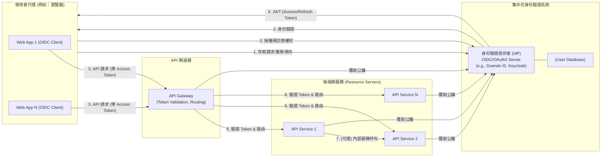

# 大型微服務架構之 JWT 身份驗證策略

## 1. 緒論

### 1.1. 目的

本文件旨在為包含數十個 Web 應用程式和數十個 API 服務的複雜、大規模微服務環境，提供一套健壯、安全且可擴展的基於 JSON Web Token (JWT) 的身份驗證和授權策略。

### 1.2. 背景與挑戰

在微服務架構下，隨著服務數量的增長，身份驗證和授權的管理變得日益複雜。傳統的單體式應用程式的認證方法難以適應這種分散式環境。主要挑戰包括：

* **一致性**：如何在眾多服務間確保一致的用戶身份和權限驗證？
* **安全性**：如何保護敏感的用戶憑證和權杖，防止未經授權的存取？
* **使用者體驗**：如何提供流暢的單一登入 (SSO) 體驗，避免使用者在不同應用間重複登入？
* **可管理性**：如何集中管理用戶、用戶端應用程式和 API 資源的存取策略？
* **可擴展性**：身份驗證基礎設施如何隨著業務的增長而擴展？

JWT 因其無狀態、易於跨服務傳遞和驗證的特性，成為解決這些挑戰的關鍵技術之一。

### 1.3. 設計目標

* **安全性**：建立強固的身份驗證和授權機制，保護系統資源。
* **單一登入 (SSO)**：允許使用者一次登入即可存取所有授權的 Web 應用程式。
* **集中式管理**：集中管理使用者身份、用戶端應用程式和 API 存取策略。
* **標準化**：遵循業界標準 (如 OAuth 2.0, OpenID Connect)，簡化整合和互操作性。
* **可擴展性**：設計能夠支持大量服務和高併發請求的身份驗證系統。
* **解耦**：身份驗證邏輯與業務服務解耦。

## 2. 核心架構組件

推薦的核心架構包含以下組件：

### 2.1. 集中式身份驗證提供者 (Identity Provider, IdP)

* **角色**：整個身份驗證系統的核心，是使用者身份的唯一可信來源 (Single Source of Truth)。
* **職責**：
  * 處理所有使用者身份驗證請求（登入、註冊、密碼管理等）。
  * 管理使用者帳戶、角色和群組。
  * 實施多因素驗證 (MFA) 等安全策略。
  * 根據 OpenID Connect (OIDC) 協議，為 Web 應用程式（用戶端）提供身份驗證服務。
  * 根據 OAuth 2.0 協議，為 API 服務（資源伺服器）發行 JWT (Access Tokens) 和 Refresh Tokens。
  * 管理已註冊的用戶端應用程式 (Web Apps) 和資源伺服器 (APIs)。
  * 透過標準端點 (如 JWKS URI - JSON Web Key Set) 發布用於驗證 JWT 簽章的公鑰。
* **技術選型建議**：Duende IdentityServer, Keycloak, Auth0, Azure AD B2C, Okta 等支援 OIDC 和 OAuth 2.0 的成熟框架或服務。

### 2.2. API 閘道器 (API Gateway)

* **角色**：作為所有外部請求（來自 Web 應用程式或其他用戶端）進入後端微服務系統的單一入口點和策略執行點。
* **在身份驗證中的職責**：
  * **權杖驗證卸載**：攔截所有對受保護 API 的請求，對傳入的 JWT Access Token 進行初步驗證（檢查簽章、發行者、有效期限）。
  * **請求路由**：將已驗證的請求路由到相應的後端 API 服務。
  * **宣告轉換/豐富**：可選地，從 JWT 中提取使用者資訊（如使用者 ID、角色），並以安全的內部標頭形式傳遞給後端服務。
  * **集中式策略執行**：執行如速率限制、日誌記錄、CORS 等橫切關注點。
* **優點**：簡化後端 API 服務的複雜性，它們可以信任來自閘道器的請求（但仍建議 API 自身進行 `audience` 驗證）。提高安全性，減少攻擊面。
* **技術選型建議**：Ocelot, YARP (Yet Another Reverse Proxy), NGINX Plus, Kong, Apigee, AWS API Gateway, Azure API Management。

### 2.3. Web 應用程式 (OIDC 用戶端)

* **角色**：使用者與系統互動的前端介面，需要對使用者進行身份驗證。
* **認證流程 (遵循 OIDC Authorization Code Flow with PKCE)**：
    1. 當使用者嘗試存取受保護資源時，Web 應用程式將使用者重新導向到 IdP。
    2. 使用者在 IdP 的登入頁面進行身份驗證。
    3. IdP 驗證成功後，將使用者重新導向回 Web 應用程式，並附帶一個授權碼 (Authorization Code)。
    4. Web 應用程式使用此授權碼向 IdP 的 Token 端點請求權杖。
    5. IdP 驗證授權碼，成功後回傳 JWT Access Token, ID Token, 和可選的 Refresh Token。
* **權杖儲存策略**：
  * **Access Token**: 應盡可能縮短其生命週期，並儲存在 Web 應用程式的後端（例如，伺服器端 Session）。避免直接儲存在瀏覽器的 `localStorage` 或 `sessionStorage` 以降低 XSS 風險。可考慮使用 Backend-for-Frontend (BFF) 模式，由 BFF 代理對 API 的呼叫。
  * **Refresh Token**: 具有較長生命週期，必須安全儲存，例如在設定了 `HttpOnly`、`Secure` 和 `SameSite=Strict` 屬性的 Cookie 中，由 Web 應用程式的後端管理。
  * **ID Token**: 用於用戶端獲取使用者身份資訊，驗證後可丟棄或僅儲存必要資訊。

### 2.4. API 服務 (OAuth 2.0 資源伺服器)

* **角色**：提供業務功能和數據，需要保護其資源免受未經授權的存取。
* **授權流程**：
    1. API 服務接收來自用戶端（通常透過 API 閘道器）的請求。
    2. 從請求的 `Authorization` 標頭中提取 `Bearer` JWT Access Token。
    3. **驗證 JWT**：
        * **簽章驗證**：使用從 IdP 的 JWKS 端點獲取的公鑰驗證 JWT 的簽章。
        * **發行者 (`iss`) 驗證**：確保權杖是由受信任的 IdP 發行。
        * **受眾 (`aud`) 驗證**：**至關重要**。確保該權杖是明確發給此 API 服務或其所屬的邏輯群組的。這可以防止權杖在不同 API 間被濫用。
        * **有效期限 (`exp`) 驗證**：確保權杖未過期。
        * 其他相關宣告驗證 (如 `nbf` - Not Before)。
    4. **授權決策**：基於 JWT 中的宣告（如角色 `roles`、權限 `permissions`、範圍 `scope`），結合 API 自身的存取控制策略，決定是否允許執行請求的操作。

## 3. JWT 生命周期與管理

### 3.1. 權杖發行

* **Access Token (存取權杖)**：
  * 由 IdP 發行，用於用戶端存取受保護的 API 資源。
  * 生命週期應較短（例如，5-60 分鐘），以降低洩漏風險。
  * 包含必要的宣告，如 `sub` (使用者ID), `iss` (發行者), `aud` (受眾), `exp` (過期時間), `iat` (發行時間), `jti` (JWT ID), 以及自訂的角色、權限等宣告。
* **Refresh Token (更新權杖)**：
  * 由 IdP 發行，用於在 Access Token 過期後，無需使用者重新登入即可獲取新的 Access Token。
  * 生命週期較長（例如，數小時、數天或直到使用者明確登出）。
  * 必須安全儲存，且只能用於向 IdP 的 Token 端點請求新的權杖。
  * IdP 應能偵測和處理 Refresh Token 的濫用（例如，輪換機制）。
* **ID Token (身份權杖)**：
  * 由 IdP 發行，遵循 OIDC 規範，用於向用戶端應用程式提供關於已驗證使用者的身份資訊。
  * 用戶端驗證其簽章和宣告後，可以信任其中的使用者資訊。

### 3.2. 權杖驗證

* **公鑰基礎設施 (PKI)**：IdP 使用私鑰簽署 JWT，API 服務（和 API 閘道器）使用 IdP 發布的對應公鑰進行驗證。公鑰通常透過 IdP 的 JWKS (`/.well-known/jwks.json`) 端點提供。
* **快取公鑰**：API 服務應快取從 JWKS 端點獲取的公鑰，並定期刷新，以避免每次驗證都請求公鑰，同時確保能及時獲取到輪換後的金鑰。

### 3.3. 權杖撤銷

* JWT 本質上是無狀態的，一旦發行，在過期前都有效。這使得即時撤銷變得困難。
* **策略**：
  * **短效期 Access Token + Refresh Token**: 這是首選策略。即使 Access Token 洩漏，其有效期也有限。撤銷主要針對 Refresh Token。
  * **權杖黑名單 (Token Blacklist)**：IdP 維護一個已撤銷權杖（或其 `jti`）的列表。API 服務在驗證權杖時查詢此列表。這會引入狀態，增加複雜性，但能實現更即時的撤銷。
  * **基於事件的撤銷**：當發生安全事件（如使用者更改密碼、登出）時，IdP 發布事件，相關系統可以訂閱此事件來更新本地的權杖有效性判斷。

## 4. 安全性最佳實踐

* **全程 HTTPS**: 所有 IdP 端點、Web 應用程式、API 閘道器和 API 服務之間的通訊都必須使用 TLS/HTTPS 加密。
* **強金鑰管理**: IdP 的 JWT 簽署金鑰（私鑰）必須得到最高級別的保護。定期安全地輪換簽署金鑰。
* **OIDC/OAuth 2.0 標準遵循**: 嚴格遵循最新的 OIDC 和 OAuth 2.0 安全最佳實踐 (例如，PKCE for public clients)。
* **最小權限原則**: JWT 中的範圍 (`scope`) 和宣告 (`claims`) 應遵循最小權限原則，僅授予必要的存取權限。
* **輸入驗證**: 對所有來自用戶端的輸入（包括登入憑證、重定向 URI 等）進行嚴格驗證。
* **防止常見攻擊**: 實施針對 XSS, CSRF, Open Redirect, Token Replay 等攻擊的防護措施。
* **安全的 Refresh Token 處理**: Refresh Token 必須作為高度敏感的憑證對待，使用 `HttpOnly`, `Secure`, `SameSite=Strict` Cookie 儲存，並實施輪換機制。
* **`audience` 驗證**: 強制要求每個 API 服務驗證 JWT 的 `aud` 宣告。
* **定期安全審計與滲透測試**: 對身份驗證系統進行定期的安全評估。

## 5. 可擴展性與可管理性

* **IdP 的可擴展性**: IdP 自身需要設計為可水平擴展的服務，以應對大量身份驗證請求。
* **API 閘道器的可擴展性**: 同樣，API 閘道器也需要能夠水平擴展。
* **標準化用戶端函式庫/SDK**: 為不同技術棧的 Web 應用程式和 API 服務提供標準化的函式庫或 SDK，以簡化與 IdP 的整合和 JWT 的處理。
* **集中式組態管理**: IdP 的端點 URL、用戶端 ID、API 資源定義等應集中管理，並透過安全的組態服務分發。
* **監控與日誌**: 對 IdP、API 閘道器和各服務的身份驗證相關事件進行全面的監控和日誌記錄，以便於故障排除和安全事件分析。
* **自動化**: 身份驗證基礎設施的部署、組態更新和金鑰輪換應盡可能自動化。

## 6. IIS 部署考量 (若適用)

* **應用程式集區隔離**: 每個 Web 應用程式、API 服務以及可能的 IdP 實例應在各自的 IIS 應用程式集區中執行。
* **HTTPS 強制**: 為所有站台設定 SSL/TLS 憑證，並強制所有流量使用 HTTPS。
* **URL Rewrite**: 可能需要 URL Rewrite 模組來處理 IdP 的標準端點、API 閘道器的路由或前端應用的路由。
* **Windows 驗證整合 (可選)**: 如果 IdP 需要與 Active Directory 整合，需妥善設定 Windows 驗證。
* **負載平衡**: 在多個 IIS 實例上部署 IdP 或 API 閘道器時，需要配置負載平衡器，並處理好 Session 親和性（如果 IdP 的某些流程需要）。

## 7. 概念架構圖

## 8. 結論

對於擁有數十個 Web 應用程式和 API 服務的大規模微服務環境，採用以**集中式身份驗證提供者 (IdP)** 為核心，遵循 **OpenID Connect 和 OAuth 2.0 標準**，並結合 **API 閘道器**進行權杖驗證卸載和請求路由的策略，是實現安全、可管理且可擴展身份驗證的最佳途徑。JWT 作為權杖格式，在其中扮演了關鍵的數據載體角色。

成功實施此策略需要仔細規劃、選擇合適的技術組件、遵循安全最佳實踐，並建立標準化的整合流程。
