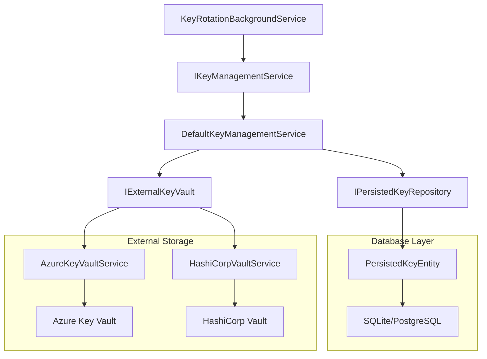
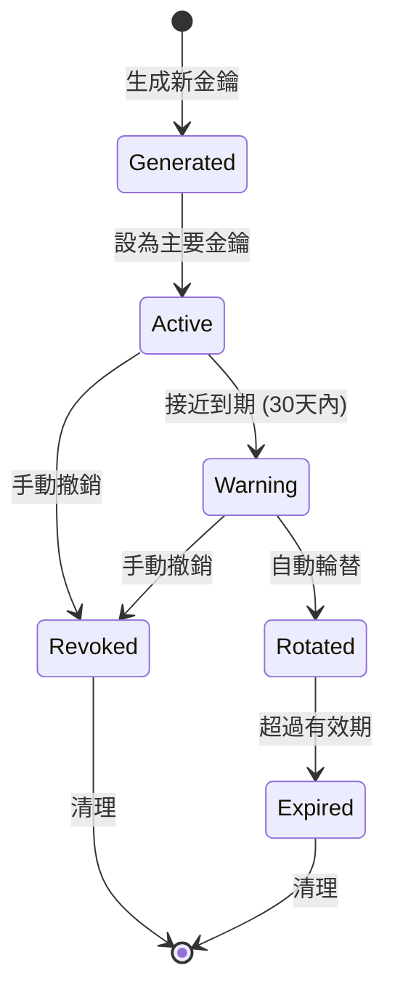

# Enterprise Key Management Architecture

> 最後更新：2025-08-17  
> 撰寫者：Claude Code Assistant  
> 需求單號：#202508170001

## 功能描述

企業級金鑰管理架構為 LocalIdentityServer 提供安全、可擴展的金鑰生命週期管理，支援自動輪替、外部存儲整合和完整的審計追蹤。

## 架構概覽



## 核心組件

### 1. IKeyManagementService 介面

高階金鑰管理服務介面，提供統一的金鑰操作 API。

**主要功能**:
- 取得當前簽章金鑰
- 生成新的 RSA 金鑰
- 執行金鑰輪替
- 金鑰健康檢查
- 統計資訊查詢

**技術規範**:
- 支援 RSA 2048/4096 位元金鑰
- 支援 RS256、RS384、RS512 演算法
- 預設金鑰有效期：1年
- 輪替警告期：30天

### 2. DefaultKeyManagementService 實作

```csharp
public class DefaultKeyManagementService : IKeyManagementService
{
    // 整合 PersistedKeyRepository
    // 提供完整的金鑰生命週期管理
    // 支援自動輪替機制
}
```

**核心方法**:
- `GetCurrentSigningKeyAsync()` - 取得主要簽章金鑰
- `GenerateNewKeyAsync()` - 生成新金鑰
- `RotateKeyIfNeededAsync()` - 自動輪替檢查
- `CheckKeyHealthAsync()` - 健康狀態檢查

### 3. IExternalKeyVault 抽象層

支援多種外部金鑰存儲的可插拔架構。

```csharp
public interface IExternalKeyVault
{
    Task<bool> StoreKeyAsync(string keyId, string keyData, KeyMetadata metadata);
    Task<string?> RetrieveKeyAsync(string keyId);
    Task<bool> DeleteKeyAsync(string keyId);
}
```

**實作提供者**:
- **AzureKeyVaultService** - Azure Key Vault 整合
- **HashiCorpVaultService** - HashiCorp Vault 整合 (未來擴展)

### 4. KeyRotationBackgroundService

自動金鑰輪替背景服務，定期執行維護任務。

**功能特色**:
- 定期健康檢查
- 自動金鑰輪替
- 過期金鑰清理
- 統計資訊記錄
- 異常通知機制

## 金鑰狀態管理

### 金鑰生命週期



### 金鑰狀態定義

| 狀態 | 描述 | IsPrimary | IsRevoked | ExpiresAt |
|------|------|-----------|-----------|-----------|
| **Active** | 活躍可用 | true/false | false | 未來時間 |
| **Warning** | 即將到期 | true/false | false | 30天內 |
| **Expired** | 已過期 | false | false | 過去時間 |
| **Revoked** | 已撤銷 | false | true | 任意 |

## 配置說明

### KeyManagement 配置

```json
{
  "KeyManagement": {
    "DefaultKeySize": 2048,
    "DefaultAlgorithm": "RS256",
    "DefaultKeyValidityDays": 365,
    "RotationWarningDays": 30,
    "MinimumKeyCount": 2,
    "EnableAutomaticRotation": true,
    "RotationCheckIntervalHours": 24
  }
}
```

### Azure Key Vault 配置

```json
{
  "AzureKeyVault": {
    "Enabled": false,
    "VaultUri": "https://your-vault.vault.azure.net/",
    "KeyPrefix": "identityserver-key",
    "TimeoutSeconds": 30
  }
}
```

## 安全考量

### 1. 金鑰保護

- **記憶體保護**: 使用 `SecureString` 和及時清理
- **傳輸加密**: 所有外部通訊使用 TLS 1.3
- **存儲加密**: 資料庫中的金鑰使用 Data Protection API 加密
- **存取控制**: 基於角色的金鑰操作權限

### 2. 輪替安全

- **平滑轉換**: 舊金鑰在新金鑰生效後保留驗證功能
- **回滾機制**: 輪替失敗時自動回滾
- **審計追蹤**: 所有金鑰操作記錄到審計日誌
- **通知機制**: 重要事件自動通知管理員

### 3. 災難復原

- **備份策略**: 定期備份金鑰到外部存儲
- **多重備援**: 支援多個 Key Vault 實例
- **快速恢復**: 自動檢測和恢復機制
- **測試驗證**: 定期災難復原演練

## 使用範例

### 基本使用

```csharp
// 取得金鑰管理服務
var keyManagementService = serviceProvider.GetRequiredService<IKeyManagementService>();

// 檢查金鑰健康狀態
var health = await keyManagementService.CheckKeyHealthAsync();
if (!health.IsHealthy)
{
    // 處理異常情況
    logger.LogWarning("Key health issues: {Issues}", health.Issues);
}

// 執行金鑰輪替檢查
var rotated = await keyManagementService.RotateKeyIfNeededAsync();
if (rotated)
{
    logger.LogInformation("Key rotation completed automatically");
}

// 取得統計資訊
var stats = await keyManagementService.GetKeyStatisticsAsync();
logger.LogInformation("Keys: {Active} active, {Expired} expired", 
    stats.ActiveKeys, stats.ExpiredKeys);
```

### 手動金鑰管理

```csharp
// 生成新金鑰
var newKeyId = await keyManagementService.GenerateNewKeyAsync(
    keySize: 4096, 
    algorithm: "RS384", 
    validityPeriod: TimeSpan.FromDays(730));

// 設為主要金鑰
await keyManagementService.SetPrimaryKeyAsync(newKeyId);

// 撤銷舊金鑰
await keyManagementService.RevokeKeyAsync(oldKeyId, "Security upgrade");
```

## 效能指標

### 預期效能

| 操作 | 目標時間 | 說明 |
|------|----------|------|
| 取得當前金鑰 | < 10ms | 從快取或資料庫 |
| 生成新金鑰 | < 500ms | RSA 2048 位元 |
| 金鑰輪替 | < 2s | 包含資料庫更新 |
| 健康檢查 | < 100ms | 快速狀態驗證 |

### 擴展性

- **並發處理**: 支援多實例並發操作
- **快取策略**: 熱金鑰記憶體快取
- **批次操作**: 支援批次金鑰操作
- **水平擴展**: 無狀態設計支援負載平衡

## 監控與告警

### 關鍵指標

1. **金鑰到期時間** - 主要金鑰剩餘有效期
2. **輪替頻率** - 自動輪替執行頻率
3. **健康檢查結果** - 系統健康狀態
4. **錯誤率** - 金鑰操作失敗率

### 告警規則

- 主要金鑰 30 天內到期 → 警告
- 主要金鑰 7 天內到期 → 緊急
- 金鑰輪替失敗 → 緊急
- 無可用金鑰 → 關鍵

## 測試策略

### 單元測試

- **服務層測試**: 所有 KeyManagementService 方法
- **Repository 測試**: 資料存取邏輯驗證
- **背景服務測試**: 輪替邏輯與定時任務

### 整合測試

- **資料庫整合**: EF Core 與實際資料庫
- **Key Vault 整合**: Azure Key Vault 連線測試
- **端到端測試**: 完整金鑰生命週期

### 安全測試

- **滲透測試**: 金鑰洩露風險評估
- **負載測試**: 高並發金鑰操作
- **災難復原測試**: 故障情境模擬

## 未來擴展

### 計劃功能

1. **多演算法支援** - ECDSA (ES256/ES384/ES512)
2. **硬體安全模組** - HSM 整合支援
3. **聯邦金鑰管理** - 跨域金鑰信任
4. **智能輪替** - 基於使用模式的動態輪替
5. **金鑰託管** - 企業級金鑰託管服務

### 技術債務

- 目前僅支援 RSA 演算法
- Key Vault 錯誤處理需要增強
- 性能優化空間 (快取策略)
- 監控儀表板開發

---

## 參考資源

- [RFC 7517 - JSON Web Key (JWK)](https://tools.ietf.org/html/rfc7517)
- [RFC 7518 - JSON Web Algorithms (JWA)](https://tools.ietf.org/html/rfc7518)
- [Azure Key Vault 最佳實踐](https://docs.microsoft.com/en-us/azure/key-vault/general/best-practices)
- [NIST SP 800-57 金鑰管理建議](https://csrc.nist.gov/publications/detail/sp/800-57-part-1/rev-5/final)

**版本歷史**:
- v1.0 (2025-08-17): 初始架構設計與實作