# 🏗️ 多層次開發架構簡報

## Enterprise Multi-Tier Development Architecture

---

## 📋 簡報大綱

1. [架構概述](#架構概述)
2. [技術堆疊](#技術堆疊)
3. [分層架構設計](#分層架構設計)
4. [專案結構分析](#專案結構分析)
5. [服務間通訊](#服務間通訊)
6. [資料流程](#資料流程)
7. [安全性架構](#安全性架構)
8. [雲端整合](#雲端整合)
9. [最佳實務](#最佳實務)
10. [總結與展望](#總結與展望)

---

## 🎯 架構概述

### 專案背景

- **專案名稱**: 信貸監控系統 (Credit Monitoring System)
- **技術框架**: .NET 8 + Blazor + Azure
- **架構模式**: 多層次分散式架構
- **開發方法**: Domain-Driven Design (DDD)

### 核心目標

- 🎯 **可擴展性**: 支援大量並發用戶
- 🔒 **安全性**: 多層次安全防護
- 🚀 **高可用性**: 99.9% 系統可用性
- 📊 **即時監控**: 實時數據處理與警報
- ☁️ **雲端原生**: Azure 雲端服務整合

---

## 🔧 技術堆疊

### 前端層 (Presentation Tier)

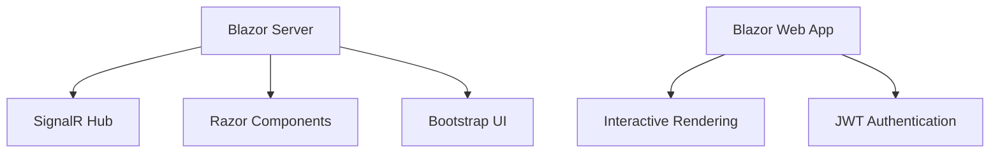

| 技術 | 版本 | 用途 |
|------|------|------|
| Blazor Server | .NET 8 | 主要前端框架 |
| Blazor Web App | .NET 8 | JWT 認證示範 |
| SignalR | .NET 8 | 即時通訊 |
| Bootstrap | 5.x | UI 框架 |
| FontAwesome | 6.x | 圖示庫 |

### 後端層 (Business Logic Tier)

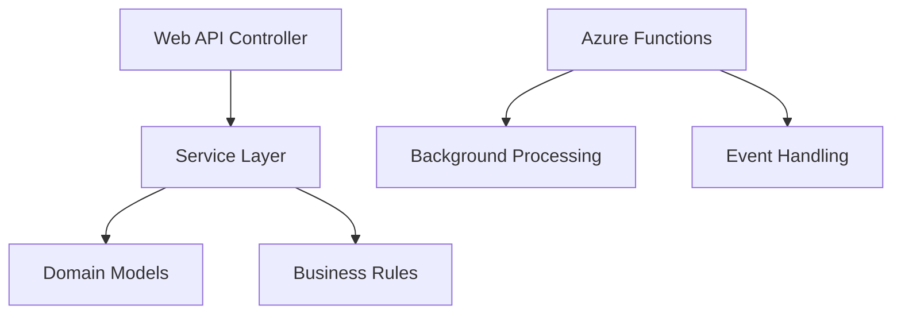

| 技術 | 版本 | 用途 |
|------|------|------|
| ASP.NET Core Web API | .NET 8 | RESTful API |
| Azure Functions | .NET 8 | 無伺服器運算 |
| SignalR | .NET 8 | 即時通訊後端 |
| Entity Framework Core | 8.x | ORM 框架 |
| FluentValidation | 11.x | 資料驗證 |

### 資料層 (Data Tier)

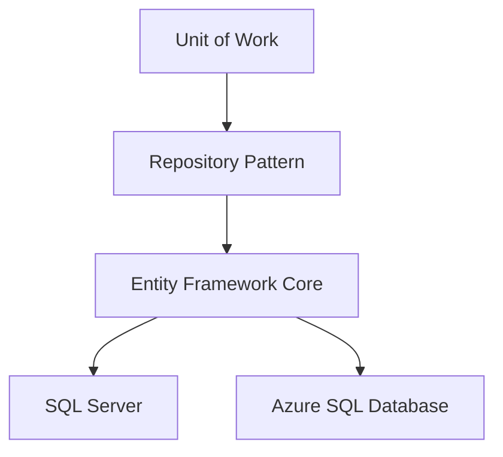

| 技術 | 版本 | 用途 |
|------|------|------|
| SQL Server | 2022 | 主要資料庫 |
| Azure SQL Database | Latest | 雲端資料庫 |
| Entity Framework Core | 8.x | 資料存取層 |
| LINQ | .NET 8 | 查詢語言 |

### 雲端服務層 (Cloud Services Tier)

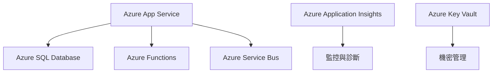

---

## 🏗️ 分層架構設計

### 1. 表現層 (Presentation Layer)

#### CreditMonitoring.Web (Blazor Server)

```
📁 CreditMonitoring.Web/
├── 📄 Program.cs                 # 應用程式啟動點
├── 📁 Pages/                     # Blazor 頁面元件
│   ├── 📄 Index.razor            # 儀表板首頁
│   ├── 📄 LoanAccounts.razor     # 貸款帳戶管理
│   ├── 📄 CreditAlerts.razor     # 信用警報頁面
│   └── 📄 Reports.razor          # 報告頁面
├── 📁 Shared/                    # 共用元件
│   ├── 📄 MainLayout.razor       # 主版面配置
│   ├── 📄 NavMenu.razor          # 導航選單
│   └── 📄 LoginDisplay.razor     # 登入狀態顯示
├── 📁 Services/                  # 前端服務
│   ├── 📄 ApiService.cs          # API 呼叫服務
│   └── 📄 NotificationService.cs # 通知服務
└── 📁 Hubs/                      # SignalR Hub
    └── 📄 NotificationHub.cs     # 即時通知中心
```

#### SimpleJwtWeb (Blazor Web App)

```
📁 SimpleJwtWeb/
├── 📄 Program.cs                 # 應用程式設定
├── 📁 Components/                # Blazor 元件
│   ├── 📁 Pages/                 # 頁面元件
│   │   ├── 📄 Home.razor         # 首頁
│   │   ├── 📄 Login.razor        # 登入頁面
│   │   ├── 📄 ApiDemo.razor      # API 示範
│   │   └── 📄 Profile.razor      # 使用者資料
│   └── 📁 Layout/                # 版面配置
│       ├── 📄 MainLayout.razor   # 主版面
│       └── 📄 NavMenu.razor      # 導航選單
├── 📁 Services/                  # 服務層
│   ├── 📄 ApiService.cs          # API 通訊服務
│   └── 📄 AuthService.cs         # 認證服務
└── 📁 Models/                    # 資料模型
    ├── 📄 LoginRequest.cs        # 登入請求模型
    └── 📄 LoginResponse.cs       # 登入回應模型
```

### 2. 業務邏輯層 (Business Logic Layer)

#### CreditMonitoring.Api (Web API)

```
📁 CreditMonitoring.Api/
├── 📄 Program.cs                 # API 啟動設定
├── 📁 Controllers/               # API 控制器
│   ├── 📄 AuthController.cs      # 認證控制器
│   └── 📄 CreditMonitoringController.cs # 主要業務控制器
├── 📁 Services/                  # 業務服務
│   ├── 📄 LoanAccountService.cs  # 貸款帳戶服務
│   └── 📄 CreditAlertService.cs  # 信用警報服務
└── 📁 Data/                      # 資料存取
    ├── 📄 CreditMonitoringDbContext.cs # EF Core DbContext
    ├── 📁 Repositories/          # 儲存庫模式
    └── 📁 Interfaces/            # 介面定義
```

#### CreditMonitoring.Functions (Azure Functions)

```
📁 CreditMonitoring.Functions/
├── 📄 Program.cs                 # Functions 主機設定
├── 📄 CreditAlertProcessor.cs    # 信用警報處理器
├── 📄 LoanReviewScheduler.cs     # 貸款審查排程器
└── 📄 ReportGenerator.cs         # 報告生成器
```

### 3. 共用層 (Shared Layer)

#### CreditMonitoring.Common

```
📁 CreditMonitoring.Common/
├── 📁 Models/                    # 領域模型
│   ├── 📄 LoanAccount.cs         # 貸款帳戶模型
│   ├── 📄 CreditAlert.cs         # 信用警報模型
│   ├── 📄 BankOfficer.cs         # 銀行職員模型
│   ├── 📄 Collateral.cs          # 擔保品模型
│   └── 📄 PaymentRecord.cs       # 付款記錄模型
├── 📁 Interfaces/                # 服務介面
│   ├── 📄 ICreditMonitoringService.cs
│   ├── 📄 ILoanAccountService.cs
│   └── 📄 ISignalRNotificationService.cs
└── 📁 Services/                  # 共用服務
    └── 📄 AuthenticationService.cs
```

---

## 🔄 服務間通訊

### 1. HTTP RESTful API

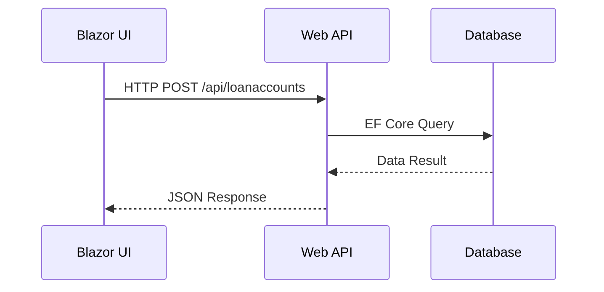

### 2. SignalR 即時通訊

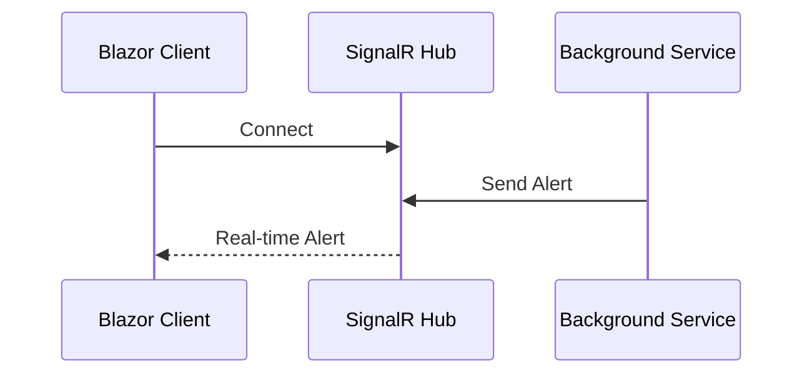

### 3. Azure Service Bus 訊息佇列

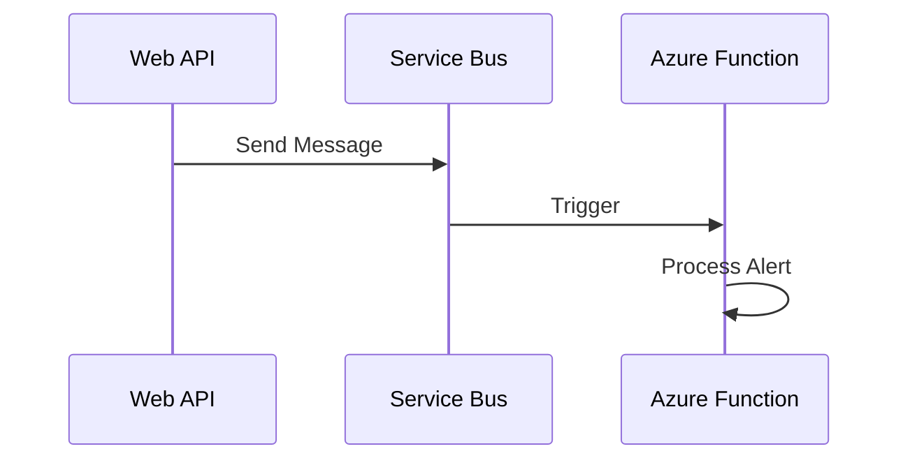

---

## 📊 資料流程

### 1. 信貸資料處理流程

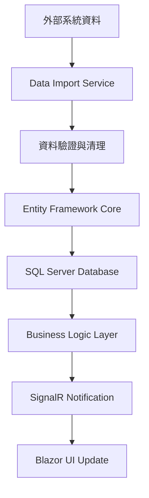

### 2. 警報處理流程

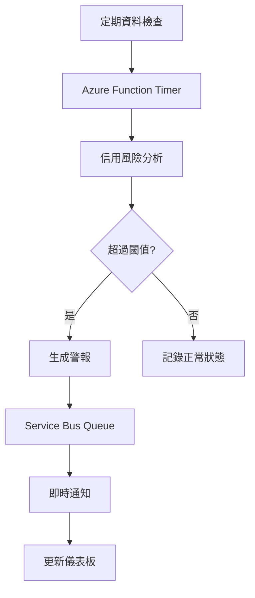

### 3. 使用者認證流程

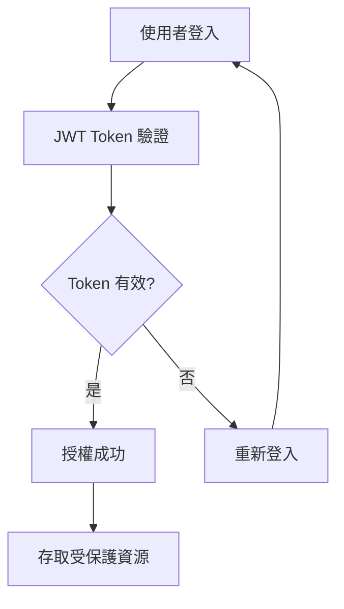

---

## 🔒 安全性架構

### 1. 認證機制

- **JWT Bearer Token**: 無狀態認證
- **Role-based Authorization**: 角色基礎授權
- **Claims-based Security**: 聲明基礎安全性

### 2. 資料保護

```csharp
// JWT 設定範例
services.AddAuthentication(JwtBearerDefaults.AuthenticationScheme)
    .AddJwtBearer(options =>
    {
        options.TokenValidationParameters = new TokenValidationParameters
        {
            ValidateIssuer = true,
            ValidateAudience = true,
            ValidateLifetime = true,
            ValidateIssuerSigningKey = true,
            ValidIssuer = configuration["Jwt:Issuer"],
            ValidAudience = configuration["Jwt:Audience"],
            IssuerSigningKey = new SymmetricSecurityKey(
                Encoding.UTF8.GetBytes(configuration["Jwt:Key"]))
        };
    });
```

### 3. 安全性層級

| 層級 | 保護措施 | 實作技術 |
|------|----------|----------|
| 網路層 | HTTPS/TLS | SSL 憑證 |
| 應用層 | JWT 認證 | ASP.NET Core Identity |
| 資料層 | 欄位加密 | SQL Server 透明資料加密 |
| 雲端層 | Azure AD | Azure Active Directory |

---

## ☁️ 雲端整合

### 1. Azure 服務架構

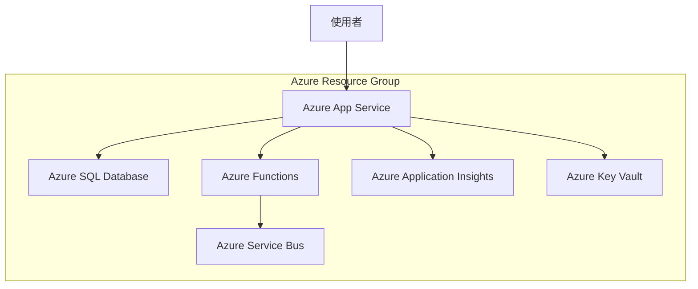

### 2. 部署策略

- **Blue-Green Deployment**: 零停機時間部署
- **Container Orchestration**: Docker + Azure Container Instances
- **Auto Scaling**: 自動擴展機制
- **Load Balancing**: Azure Load Balancer

### 3. 監控與診斷

```csharp
// Application Insights 設定
services.AddApplicationInsightsTelemetry(configuration["ApplicationInsights:ConnectionString"]);

// 自訂遙測
public class CustomTelemetryService
{
    private readonly TelemetryClient _telemetryClient;
    
    public void TrackCreditAlert(CreditAlert alert)
    {
        _telemetryClient.TrackEvent("CreditAlertGenerated", new Dictionary<string, string>
        {
            ["LoanAccountId"] = alert.LoanAccountId,
            ["Severity"] = alert.Severity.ToString(),
            ["Amount"] = alert.LoanAmount.ToString()
        });
    }
}
```

---

## ✨ 最佳實務

### 1. 程式碼品質

- **SOLID 原則**: 單一職責、開放封閉、里氏替換、介面隔離、依賴反轉
- **Clean Architecture**: 依賴反向、關注點分離
- **Domain-Driven Design**: 領域驅動設計
- **Test-Driven Development**: 測試驅動開發

### 2. 效能優化

```csharp
// 非同步程式設計
public async Task<IEnumerable<LoanAccount>> GetLoanAccountsAsync()
{
    return await _context.LoanAccounts
        .Where(la => la.IsActive)
        .AsNoTracking()
        .ToListAsync();
}

// 快取策略
[ResponseCache(Duration = 300)]
public async Task<IActionResult> GetDashboardData()
{
    var data = await _cacheService.GetOrSetAsync(
        "dashboard_data",
        () => _dashboardService.GetDataAsync(),
        TimeSpan.FromMinutes(5));
    
    return Ok(data);
}
```

### 3. 錯誤處理

```csharp
// 全域異常處理
public class GlobalExceptionMiddleware
{
    public async Task InvokeAsync(HttpContext context, RequestDelegate next)
    {
        try
        {
            await next(context);
        }
        catch (BusinessException ex)
        {
            await HandleBusinessExceptionAsync(context, ex);
        }
        catch (Exception ex)
        {
            await HandleGenericExceptionAsync(context, ex);
        }
    }
}
```

### 4. 設定管理

```json
{
  "ConnectionStrings": {
    "DefaultConnection": "#{ConnectionString}#",
    "AzureServiceBus": "#{ServiceBusConnectionString}#"
  },
  "Jwt": {
    "Key": "#{JwtKey}#",
    "Issuer": "#{JwtIssuer}#",
    "Audience": "#{JwtAudience}#"
  },
  "ApplicationInsights": {
    "ConnectionString": "#{AppInsightsConnectionString}#"
  }
}
```

---

## 📈 架構優勢

### 1. 可擴展性 (Scalability)

- **水平擴展**: 支援多實例部署
- **垂直擴展**: 彈性資源調整
- **微服務架構**: 獨立擴展各服務

### 2. 可維護性 (Maintainability)

- **模組化設計**: 清晰的職責分離
- **介面抽象**: 降低耦合度
- **統一標準**: 一致的程式碼風格

### 3. 可測試性 (Testability)

- **依賴注入**: 便於單元測試
- **介面驅動**: 支援模擬測試
- **分層測試**: 單元、整合、E2E 測試

### 4. 安全性 (Security)

- **多層防護**: 縱深防禦策略
- **最小權限**: 角色基礎存取控制
- **資料加密**: 傳輸與儲存加密

---

## 🔮 未來發展

### 1. 技術演進

- **雲端原生**: 全面擁抱雲端服務
- **容器化**: Docker + Kubernetes
- **微服務**: 服務網格 (Service Mesh)
- **事件驅動**: Event Sourcing + CQRS

### 2. 功能擴展

- **AI/ML 整合**: 智能風險預測
- **區塊鏈**: 交易透明度
- **IoT 整合**: 物聯網資料收集
- **邊緣運算**: 分散式處理

### 3. 開發流程

- **DevOps**: CI/CD 自動化
- **GitOps**: 基礎設施即程式碼
- **ObservabilityOps**: 可觀測性運維
- **MLOps**: 機器學習運維

---

## 🎯 總結與展望

### 核心成就

- ✅ **完整的多層次架構**: 從前端到後端的完整解決方案
- ✅ **現代化技術堆疊**: .NET 8 + Blazor + Azure 雲端服務
- ✅ **生產級別品質**: 安全、高效、可擴展的企業級架構
- ✅ **實戰經驗積累**: 真實專案的開發與部署經驗

### 學習價值

1. **架構設計能力**: 掌握企業級系統架構設計原則
2. **技術整合能力**: 熟練整合多種現代化技術
3. **雲端開發經驗**: Azure 雲端服務的實際應用
4. **最佳實務應用**: 業界標準的開發模式與實務

### 持續改進

- 🔄 **持續重構**: 程式碼品質持續提升
- 📊 **效能監控**: 系統效能持續優化
- 🛡️ **安全加固**: 安全機制持續強化
- 🚀 **功能擴展**: 業務需求持續滿足

---

## 📚 參考資源

### 官方文檔

- [.NET 8 官方文檔](https://docs.microsoft.com/dotnet/)
- [Blazor 官方指南](https://docs.microsoft.com/aspnet/core/blazor/)
- [Azure 服務文檔](https://docs.microsoft.com/azure/)
- [Entity Framework Core](https://docs.microsoft.com/ef/core/)

### 架構指南

- [Microsoft Architecture Guides](https://docs.microsoft.com/dotnet/architecture/)
- [Azure Architecture Center](https://docs.microsoft.com/azure/architecture/)
- [Clean Architecture](https://blog.cleancoder.com/uncle-bob/2012/08/13/the-clean-architecture.html)

### 最佳實務

- [.NET Application Architecture Guides](https://dotnet.microsoft.com/learn/dotnet/architecture-guides)
- [Azure Well-Architected Framework](https://docs.microsoft.com/azure/architecture/framework/)

---

**簡報製作**: GitHub Copilot AI Assistant  
**文檔版本**: 1.0.0  
**最後更新**: 2025年6月11日  
**技術堆疊**: .NET 8, Blazor, Azure, Entity Framework Core
