# 🏗️ 通用多層次開發架構簡報

## Universal Multi-Tier Development Architecture

---

## 📋 簡報大綱

1. [架構基礎概念](#架構基礎概念)
2. [分層架構模式](#分層架構模式)
3. [技術選型原則](#技術選型原則)
4. [設計模式與原則](#設計模式與原則)
5. [數據層設計](#數據層設計)
6. [業務邏輯層](#業務邏輯層)
7. [表現層架構](#表現層架構)
8. [跨層關注點](#跨層關注點)
9. [架構質量屬性](#架構質量屬性)
10. [實施策略](#實施策略)

---

## 🎯 架構基礎概念

### 什麼是多層次架構？

多層次架構（Multi-Tier Architecture）是一種將應用程式邏輯分解為多個獨立層次的軟體設計模式，每個層次負責特定的功能和責任。

### 核心原則

- 🔗 **關注點分離** (Separation of Concerns)
- 🏗️ **單一職責** (Single Responsibility)
- 🔄 **依賴反轉** (Dependency Inversion)
- 🛡️ **封裝性** (Encapsulation)
- 🔧 **可擴展性** (Scalability)

### 架構優勢

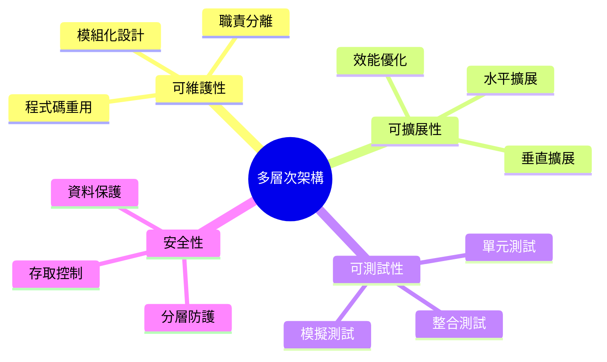

---

## 🏗️ 分層架構模式

### 經典三層架構

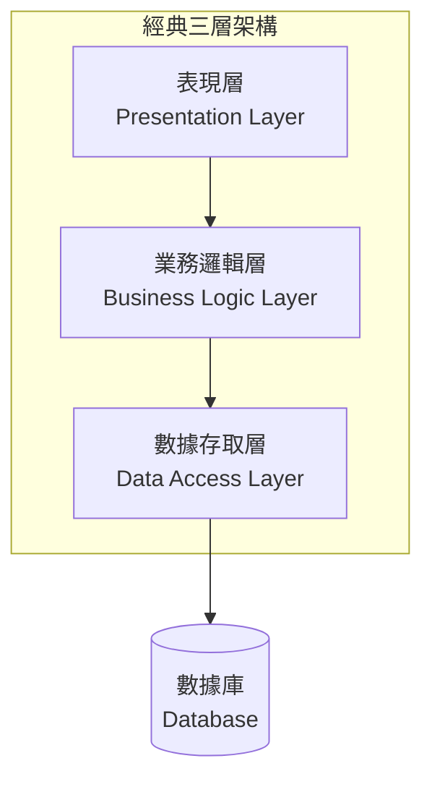

### 現代 N 層架構

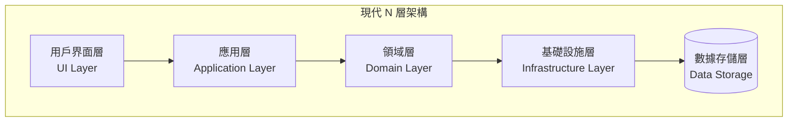

### 微服務架構

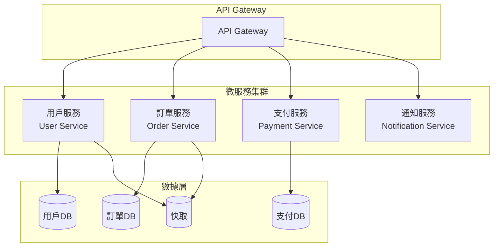

---

## 🔧 技術選型原則

### 前端技術選型

| 技術類型 | 企業級選項 | 適用場景 |
|----------|------------|----------|
| **Web 框架** | React, Angular, Vue.js, Blazor | 企業級 SPA 應用 |
| **移動端** | React Native, Flutter, Xamarin | 跨平台移動應用 |
| **桌面應用** | Electron, WPF, WinUI | 企業級桌面應用 |
| **UI 庫** | Material-UI, Ant Design, Bootstrap | 統一設計語言 |

### 後端技術選型

| 技術類型 | 企業級選項 | 適用場景 |
|----------|------------|----------|
| **框架** | .NET Core, Spring Boot, Node.js | 高效能 API 開發 |
| **數據庫** | SQL Server, PostgreSQL, Oracle | 關聯式數據存儲 |
| **NoSQL** | MongoDB, Redis, Elasticsearch | 非關聯式數據存儲 |
| **訊息佇列** | RabbitMQ, Apache Kafka, Azure Service Bus | 非同步處理 |

### 雲端平台選型

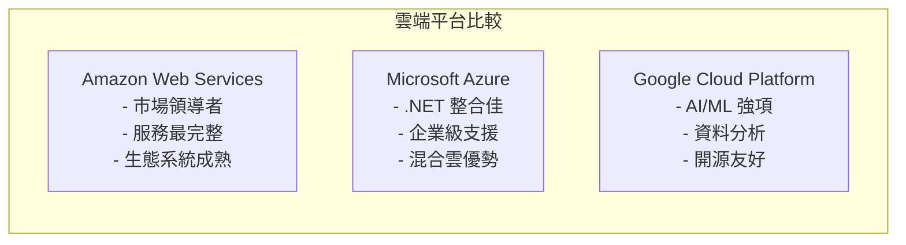

---

## 🎨 架構設計原則

> **章節說明**: 本章節介紹多層次架構設計的核心原則，為後續架構實現提供理論基礎和實務指導。

### SOLID 設計原則

SOLID 原則是軟體架構設計的基石，確保系統具備良好的可維護性、可擴展性和可測試性：

| 原則 | 英文名稱 | 核心概念 | 架構應用 |
|------|----------|----------|----------|
| **S** | Single Responsibility | 單一職責 | 每個模組/服務只負責一個業務領域 |
| **O** | Open/Closed | 開放封閉 | 通過介面和抽象支援功能擴展 |
| **L** | Liskov Substitution | 里氏替換 | 子類別可無縫替換父類別 |
| **I** | Interface Segregation | 介面隔離 | 避免大而全的介面設計 |
| **D** | Dependency Inversion | 依賴反轉 | 依賴抽象層而非具體實現 |

### 關鍵架構模式

以下是多層次架構中最常用的設計模式，按使用頻率和重要性排序：

| 優先級 | 模式類型 | 設計模式 | 架構層級 | 主要用途 |
|--------|----------|----------|----------|----------|
| ⭐⭐⭐ | **結構型** | 依賴注入 | 全層級 | 解耦合、可測試性 |
| ⭐⭐⭐ | **結構型** | Repository | 數據層 | 數據存取抽象 |
| ⭐⭐ | **創建型** | 工廠模式 | 業務層 | 對象創建管理 |
| ⭐⭐ | **行為型** | 策略模式 | 業務層 | 算法/規則替換 |
| ⭐ | **結構型** | 裝飾器模式 | 跨層級 | 功能增強（如日誌） |
| ⭐ | **行為型** | 觀察者模式 | 表現層 | 事件通知機制 |

### 架構模式實例

```csharp
// 依賴注入示例
public interface IUserService
{
    Task<User> GetUserAsync(int id);
    Task<User> CreateUserAsync(CreateUserRequest request);
}

public class UserService : IUserService
{
    private readonly IUserRepository _userRepository;
    private readonly ILogger<UserService> _logger;
    
    public UserService(IUserRepository userRepository, ILogger<UserService> logger)
    {
        _userRepository = userRepository;
        _logger = logger;
    }
    
    public async Task<User> GetUserAsync(int id)
    {
        _logger.LogInformation("Getting user with id: {UserId}", id);
        return await _userRepository.GetByIdAsync(id);
    }
}

// Repository 模式示例
public interface IUserRepository
{
    Task<User> GetByIdAsync(int id);
    Task<IEnumerable<User>> GetAllAsync();
    Task<User> CreateAsync(User user);
    Task UpdateAsync(User user);
    Task DeleteAsync(int id);
}
```

---

## 💾 數據層設計

### 數據存取模式

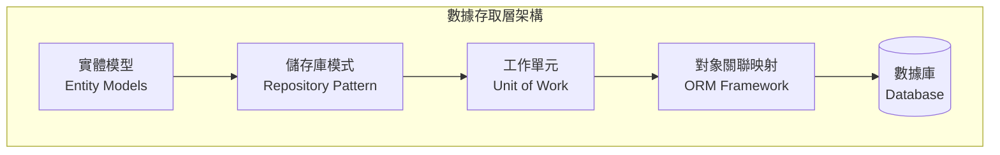

### ORM 框架比較

| ORM 框架 | 平台 | 特點 | 適用場景 |
|----------|------|------|----------|
| **Entity Framework Core** | .NET | Code First, 強型別 | .NET 生態系統 |
| **Hibernate** | Java | 成熟穩定, 功能豐富 | Java 企業應用 |
| **Sequelize** | Node.js | Promise 支援, 活躍社群 | Node.js 應用 |
| **Django ORM** | Python | 簡潔易用, 內建遷移 | Python Web 應用 |

### 數據庫設計原則

```sql
-- 正規化示例
CREATE TABLE Users (
    Id INT PRIMARY KEY IDENTITY,
    Username NVARCHAR(50) NOT NULL UNIQUE,
    Email NVARCHAR(100) NOT NULL UNIQUE,
    PasswordHash NVARCHAR(256) NOT NULL,
    CreatedAt DATETIME2 DEFAULT GETDATE(),
    UpdatedAt DATETIME2 DEFAULT GETDATE()
);

CREATE TABLE UserProfiles (
    Id INT PRIMARY KEY IDENTITY,
    UserId INT NOT NULL,
    FirstName NVARCHAR(50),
    LastName NVARCHAR(50),
    PhoneNumber NVARCHAR(20),
    Address NVARCHAR(500),
    FOREIGN KEY (UserId) REFERENCES Users(Id)
);

-- 索引優化
CREATE INDEX IX_Users_Email ON Users(Email);
CREATE INDEX IX_Users_Username ON Users(Username);
CREATE INDEX IX_UserProfiles_UserId ON UserProfiles(UserId);
```

---

## 🧩 業務邏輯層

### 領域驅動設計 (DDD)

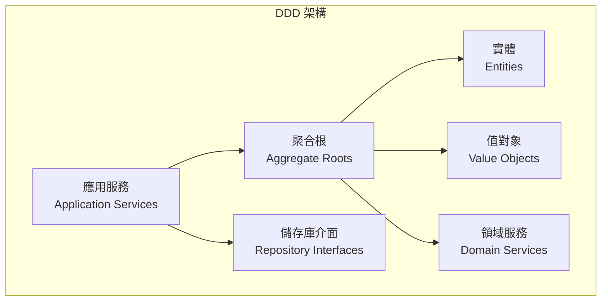

### 業務邏輯實現

```csharp
// 領域實體
public class Order
{
    public int Id { get; private set; }
    public string OrderNumber { get; private set; }
    public DateTime OrderDate { get; private set; }
    public OrderStatus Status { get; private set; }
    public decimal TotalAmount { get; private set; }
    
    private readonly List<OrderItem> _items = new();
    public IReadOnlyList<OrderItem> Items => _items.AsReadOnly();
    
    public void AddItem(Product product, int quantity, decimal price)
    {
        if (Status != OrderStatus.Draft)
            throw new InvalidOperationException("Cannot modify confirmed order");
            
        var existingItem = _items.FirstOrDefault(i => i.ProductId == product.Id);
        if (existingItem != null)
        {
            existingItem.UpdateQuantity(existingItem.Quantity + quantity);
        }
        else
        {
            _items.Add(new OrderItem(product.Id, quantity, price));
        }
        
        RecalculateTotal();
    }
    
    public void Confirm()
    {
        if (_items.Count == 0)
            throw new InvalidOperationException("Cannot confirm empty order");
            
        Status = OrderStatus.Confirmed;
    }
    
    private void RecalculateTotal()
    {
        TotalAmount = _items.Sum(i => i.Subtotal);
    }
}

// 應用服務
public class OrderApplicationService
{
    private readonly IOrderRepository _orderRepository;
    private readonly IProductRepository _productRepository;
    private readonly IUnitOfWork _unitOfWork;
    
    public async Task<int> CreateOrderAsync(CreateOrderCommand command)
    {
        var order = new Order(command.CustomerId);
        
        foreach (var item in command.Items)
        {
            var product = await _productRepository.GetByIdAsync(item.ProductId);
            if (product == null)
                throw new ProductNotFoundException(item.ProductId);
                
            order.AddItem(product, item.Quantity, product.Price);
        }
        
        await _orderRepository.AddAsync(order);
        await _unitOfWork.SaveChangesAsync();
        
        return order.Id;
    }
}
```

### 服務層模式

| 服務類型 | 職責 | 示例 |
|----------|------|------|
| **應用服務** | 協調業務流程 | `OrderApplicationService` |
| **領域服務** | 複雜業務邏輯 | `PricingDomainService` |
| **基礎設施服務** | 外部系統整合 | `EmailNotificationService` |

---

## 🎭 表現層架構

### 前端架構模式

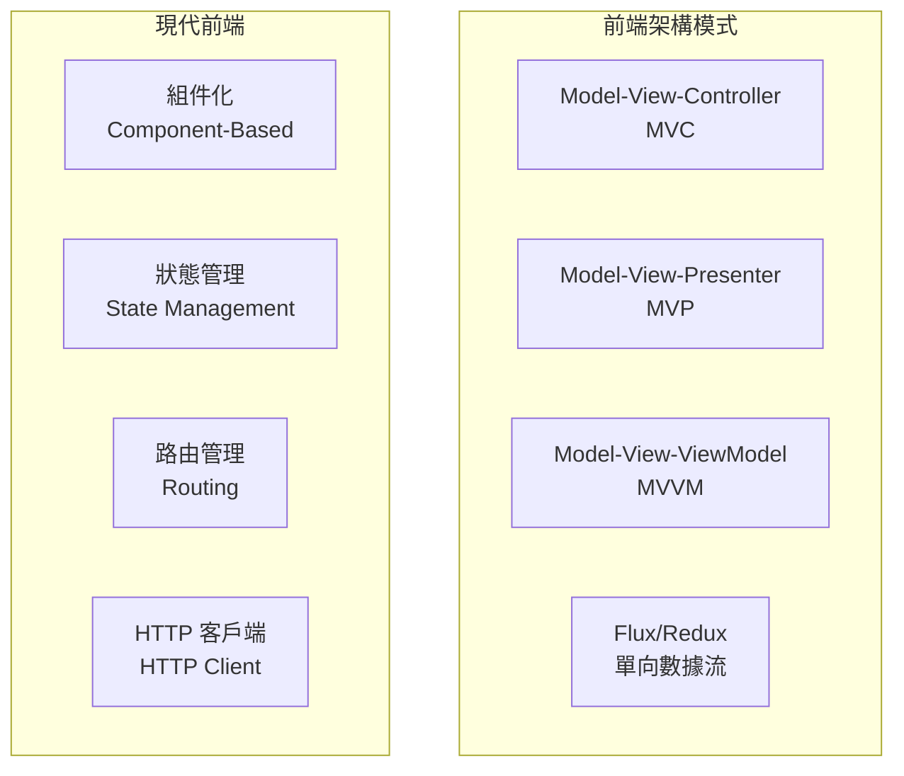

### API 設計原則

```csharp
// RESTful API 設計
[ApiController]
[Route("api/[controller]")]
public class UsersController : ControllerBase
{
    [HttpGet]
    public async Task<ActionResult<PagedResult<UserDto>>> GetUsers(
        [FromQuery] UserSearchCriteria criteria)
    {
        var users = await _userService.SearchUsersAsync(criteria);
        return Ok(users);
    }
    
    [HttpGet("{id}")]
    public async Task<ActionResult<UserDto>> GetUser(int id)
    {
        var user = await _userService.GetUserAsync(id);
        if (user == null)
            return NotFound();
            
        return Ok(user);
    }
    
    [HttpPost]
    public async Task<ActionResult<UserDto>> CreateUser(CreateUserRequest request)
    {
        var user = await _userService.CreateUserAsync(request);
        return CreatedAtAction(nameof(GetUser), new { id = user.Id }, user);
    }
    
    [HttpPut("{id}")]
    public async Task<IActionResult> UpdateUser(int id, UpdateUserRequest request)
    {
        await _userService.UpdateUserAsync(id, request);
        return NoContent();
    }
    
    [HttpDelete("{id}")]
    public async Task<IActionResult> DeleteUser(int id)
    {
        await _userService.DeleteUserAsync(id);
        return NoContent();
    }
}
```

### HTTP 狀態碼最佳實務

| 狀態碼 | 意義 | 使用場景 |
|--------|------|----------|
| **200 OK** | 成功 | GET, PUT 成功 |
| **201 Created** | 已創建 | POST 成功創建資源 |
| **204 No Content** | 無內容 | DELETE 成功 |
| **400 Bad Request** | 請求錯誤 | 驗證失敗 |
| **401 Unauthorized** | 未認證 | 需要登入 |
| **403 Forbidden** | 已認證但無權限 | 權限不足 |
| **404 Not Found** | 資源不存在 | 找不到指定資源 |
| **500 Internal Server Error** | 伺服器錯誤 | 未處理的異常 |

---

## 🔄 跨層關注點

### 安全性架構

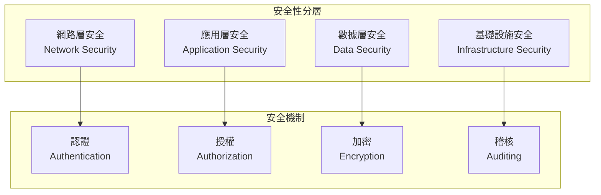

### 日誌記錄策略

```csharp
// 結構化日誌
public class OrderService
{
    private readonly ILogger<OrderService> _logger;
    
    public async Task<Order> ProcessOrderAsync(int orderId)
    {
        using var scope = _logger.BeginScope("Processing order {OrderId}", orderId);
        
        try
        {
            _logger.LogInformation("Starting order processing");
            
            var order = await _orderRepository.GetByIdAsync(orderId);
            if (order == null)
            {
                _logger.LogWarning("Order not found");
                throw new OrderNotFoundException(orderId);
            }
            
            // 業務邏輯處理
            await ProcessPayment(order);
            await UpdateInventory(order);
            await SendConfirmationEmail(order);
            
            _logger.LogInformation("Order processed successfully");
            return order;
        }
        catch (Exception ex)
        {
            _logger.LogError(ex, "Failed to process order");
            throw;
        }
    }
}
```

### 異常處理策略

```csharp
// 全域異常處理中介軟體
public class ExceptionHandlingMiddleware
{
    private readonly RequestDelegate _next;
    private readonly ILogger<ExceptionHandlingMiddleware> _logger;
    
    public async Task InvokeAsync(HttpContext context)
    {
        try
        {
            await _next(context);
        }
        catch (Exception ex)
        {
            _logger.LogError(ex, "An unhandled exception occurred");
            await HandleExceptionAsync(context, ex);
        }
    }
    
    private static async Task HandleExceptionAsync(HttpContext context, Exception exception)
    {
        var response = exception switch
        {
            ValidationException ex => new { error = "Validation failed", details = ex.Errors },
            NotFoundException ex => new { error = "Resource not found", message = ex.Message },
            UnauthorizedException ex => new { error = "Unauthorized", message = ex.Message },
            _ => new { error = "Internal server error", message = "An error occurred" }
        };
        
        var statusCode = exception switch
        {
            ValidationException => StatusCodes.Status400BadRequest,
            NotFoundException => StatusCodes.Status404NotFound,
            UnauthorizedException => StatusCodes.Status401Unauthorized,
            _ => StatusCodes.Status500InternalServerError
        };
        
        context.Response.StatusCode = statusCode;
        context.Response.ContentType = "application/json";
        
        await context.Response.WriteAsync(JsonSerializer.Serialize(response));
    }
}
```

### 效能監控

```csharp
// 效能監控裝飾器
public class PerformanceMonitoringDecorator<T> : IService<T>
{
    private readonly IService<T> _innerService;
    private readonly IMetrics _metrics;
    private readonly ILogger _logger;
    
    public async Task<T> ExecuteAsync(Request request)
    {
        var stopwatch = Stopwatch.StartNew();
        var operationName = typeof(T).Name;
        
        try
        {
            var result = await _innerService.ExecuteAsync(request);
            
            stopwatch.Stop();
            _metrics.RecordExecutionTime(operationName, stopwatch.ElapsedMilliseconds);
            _logger.LogInformation("Operation {Operation} completed in {Duration}ms", 
                operationName, stopwatch.ElapsedMilliseconds);
                
            return result;
        }
        catch (Exception ex)
        {
            stopwatch.Stop();
            _metrics.RecordError(operationName);
            _logger.LogError(ex, "Operation {Operation} failed after {Duration}ms", 
                operationName, stopwatch.ElapsedMilliseconds);
            throw;
        }
    }
}
```

---

## 📊 架構質量屬性

### 可擴展性設計

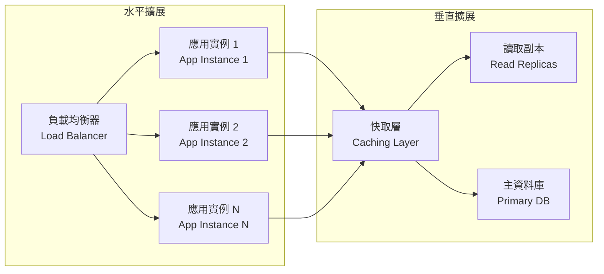

### 效能優化策略

| 優化層級 | 策略 | 技術實現 |
|----------|------|----------|
| **應用層** | 快取策略 | Redis, Memcached |
| **數據層** | 查詢優化 | 索引, 查詢調整 |
| **網路層** | CDN 加速 | CloudFlare, Azure CDN |
| **前端** | 資源優化 | 壓縮, 懶載入 |

### 可用性設計

```csharp
// 斷路器模式
public class CircuitBreakerService
{
    private readonly IExternalService _externalService;
    private readonly CircuitBreakerOptions _options;
    private CircuitBreakerState _state = CircuitBreakerState.Closed;
    private int _failureCount = 0;
    private DateTime _lastFailureTime;
    
    public async Task<T> ExecuteAsync<T>(Func<Task<T>> operation)
    {
        if (_state == CircuitBreakerState.Open)
        {
            if (DateTime.UtcNow - _lastFailureTime > _options.Timeout)
            {
                _state = CircuitBreakerState.HalfOpen;
            }
            else
            {
                throw new CircuitBreakerOpenException();
            }
        }
        
        try
        {
            var result = await operation();
            OnSuccess();
            return result;
        }
        catch (Exception)
        {
            OnFailure();
            throw;
        }
    }
    
    private void OnSuccess()
    {
        _failureCount = 0;
        _state = CircuitBreakerState.Closed;
    }
    
    private void OnFailure()
    {
        _failureCount++;
        _lastFailureTime = DateTime.UtcNow;
        
        if (_failureCount >= _options.FailureThreshold)
        {
            _state = CircuitBreakerState.Open;
        }
    }
}
```

---

## 🚀 實施策略

### 分階段實施計劃

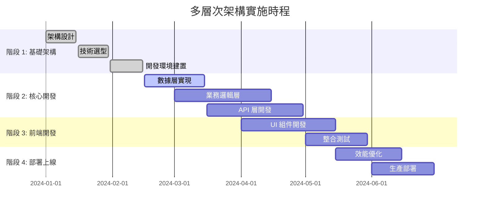

### 技術債務管理

```csharp
// 技術債務追蹤
public class TechnicalDebtItem
{
    public string Id { get; set; }
    public string Description { get; set; }
    public TechnicalDebtSeverity Severity { get; set; }
    public TechnicalDebtCategory Category { get; set; }
    public DateTime CreatedDate { get; set; }
    public string CreatedBy { get; set; }
    public int EstimatedEffortHours { get; set; }
    public string[] AffectedComponents { get; set; }
    public string ProposedSolution { get; set; }
}

public enum TechnicalDebtSeverity
{
    Low,
    Medium,
    High,
    Critical
}

public enum TechnicalDebtCategory
{
    CodeQuality,
    Performance,
    Security,
    Maintainability,
    Documentation
}
```

### 代碼品質保證

| 階段 | 工具/方法 | 目標 |
|------|-----------|------|
| **開發階段** | IDE 分析器, SonarLint | 即時代碼檢查 |
| **提交前** | Pre-commit hooks | 格式化, 基本檢查 |
| **CI/CD** | SonarQube, CodeClimate | 深度代碼分析 |
| **Code Review** | Pull Request | 人工代碼審查 |

### 測試策略

```mermaid
pyramid
    title 測試金字塔
    
    "E2E 測試\n(少量)"
    "整合測試\n(適量)"
    "單元測試\n(大量)"
```

```csharp
// 單元測試示例
[TestFixture]
public class OrderServiceTests
{
    private Mock<IOrderRepository> _orderRepositoryMock;
    private Mock<IUnitOfWork> _unitOfWorkMock;
    private OrderService _orderService;
    
    [SetUp]
    public void Setup()
    {
        _orderRepositoryMock = new Mock<IOrderRepository>();
        _unitOfWorkMock = new Mock<IUnitOfWork>();
        _orderService = new OrderService(_orderRepositoryMock.Object, _unitOfWorkMock.Object);
    }
    
    [Test]
    public async Task CreateOrder_ValidRequest_ReturnsOrderId()
    {
        // Arrange
        var request = new CreateOrderRequest { CustomerId = 1, Items = new[] { ... } };
        var expectedOrderId = 123;
        
        _orderRepositoryMock
            .Setup(r => r.AddAsync(It.IsAny<Order>()))
            .Returns(Task.CompletedTask);
            
        // Act
        var result = await _orderService.CreateOrderAsync(request);
        
        // Assert
        Assert.That(result, Is.EqualTo(expectedOrderId));
        _orderRepositoryMock.Verify(r => r.AddAsync(It.IsAny<Order>()), Times.Once);
        _unitOfWorkMock.Verify(u => u.SaveChangesAsync(), Times.Once);
    }
}
```

---

## 📈 架構演進策略

### 微服務遷移路徑

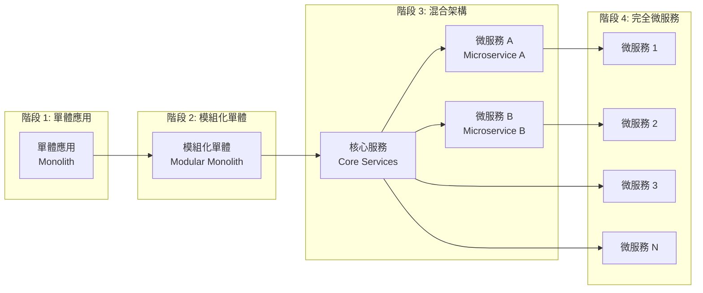

### 現代化技術趨勢

| 技術領域 | 趨勢 | 影響 |
|----------|------|------|
| **容器化** | Docker, Kubernetes | 部署標準化 |
| **無伺服器** | Function as a Service | 成本優化 |
| **邊緣計算** | Edge Computing | 低延遲服務 |
| **AI/ML 整合** | 智能化應用 | 業務創新 |

---

## 🎯 總結與最佳實務

### 架構設計核心原則

1. **🎯 以業務為中心**: 架構服務於業務目標
2. **🔧 漸進式演進**: 避免過度設計，逐步優化
3. **📊 數據驅動決策**: 基於監控數據做架構調整
4. **🛡️ 安全第一**: 安全性貫穿整個架構設計
5. **📈 可觀測性**: 內建監控、日誌、追蹤能力

### 實施檢查清單

- [ ] **架構文檔**: 清晰的架構圖和說明文檔
- [ ] **技術選型**: 基於需求的合理技術選擇
- [ ] **代碼規範**: 統一的編碼標準和最佳實務
- [ ] **測試策略**: 完整的測試覆蓋率和自動化
- [ ] **CI/CD 流水線**: 自動化建置、測試、部署
- [ ] **監控告警**: 全面的系統監控和告警機制
- [ ] **安全審查**: 安全性評估和漏洞掃描
- [ ] **效能基準**: 效能目標和基準測試
- [ ] **災難恢復**: 備份和災難恢復計劃
- [ ] **文檔維護**: 持續更新的技術文檔

### 常見陷阱與解決方案

| 陷阱 | 影響 | 解決方案 |
|------|------|----------|
| **過度工程** | 複雜度增加，交付延遲 | YAGNI 原則，按需實現 |
| **技術債務累積** | 維護成本上升 | 定期重構，持續改進 |
| **單點故障** | 系統可用性風險 | 冗餘設計，故障轉移 |
| **數據不一致** | 業務邏輯錯誤 | 事務管理，最終一致性 |

---

## 🔮 未來展望

### 新興技術趨勢

- **🤖 AI 原生應用**: 內建 AI 能力的應用架構
- **🌐 Web3 整合**: 去中心化應用架構
- **🔋 綠色計算**: 環保節能的架構設計
- **🚀 量子計算**: 面向量子時代的架構準備

### 持續學習建議

1. **關注技術社群**: GitHub, Stack Overflow, Reddit
2. **閱讀架構書籍**: 《Clean Architecture》、《Building Microservices》
3. **參與開源專案**: 實際體驗大型專案架構
4. **技術會議**: 參加 KubeCon, DockerCon 等技術會議
5. **認證考試**: AWS/Azure/GCP 架構師認證

---

## 📚 延伸閱讀

### 經典架構書籍

- 📖 **《Clean Architecture》** - Robert C. Martin
- 📖 **《Patterns of Enterprise Application Architecture》** - Martin Fowler
- 📖 **《Building Microservices》** - Sam Newman
- 📖 **《Domain-Driven Design》** - Eric Evans

### 線上資源

- 🌐 **Microsoft Architecture Guides**: <https://docs.microsoft.com/architecture/>
- 🌐 **AWS Architecture Center**: <https://aws.amazon.com/architecture/>
- 🌐 **Google Cloud Architecture**: <https://cloud.google.com/architecture>
- 🌐 **The Twelve-Factor App**: <https://12factor.net/>

### 工具與平台

- 🛠️ **架構建模**: Lucidchart, Draw.io, ArchiMate
- 🛠️ **代碼分析**: SonarQube, CodeClimate, Resharper
- 🛠️ **監控平台**: Prometheus, Grafana, ELK Stack
- 🛠️ **容器平台**: Docker, Kubernetes, OpenShift

---

**文檔版本**: 1.0.0  
**最後更新**: 2025年6月11日  
**適用範圍**: 通用企業級應用開發  
**維護者**: 架構團隊
